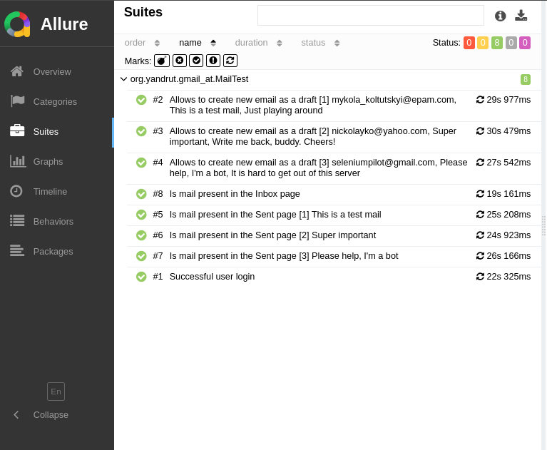
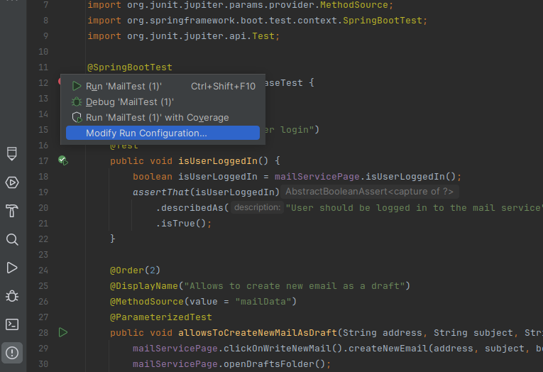
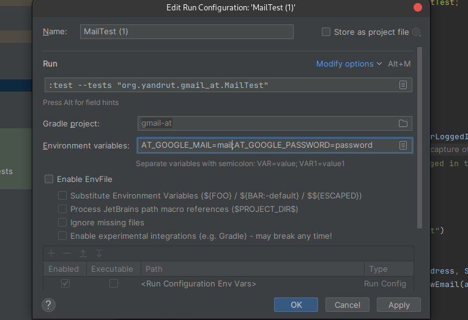

Task for using WebDriver API with any mail service, with few simple scenarios

**Task description:** 

For running this framework using IDE, use:

Paste values of the environment variables
`AT_GOOGLE_MAIL=mail`
`AT_GOOGLE_PASSWORD=password`

For running this framework using CLI, use these commands export or set (if you're on Windows):
`export AT_GOOGLE_MAIL=mail`
`export AT_GOOGLE_PASSWORD=password`
`./gradlew test`

For generating the Allure Report use:
`allure generate`
`allure serve`