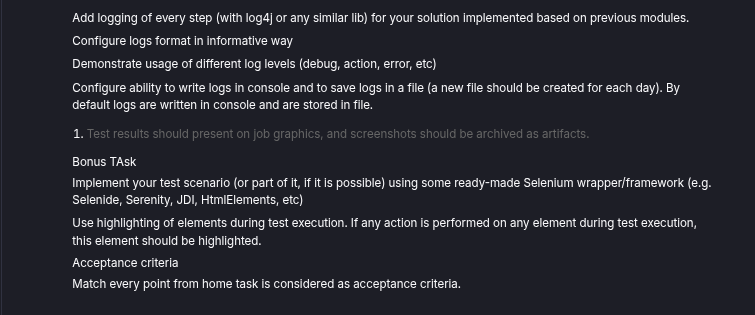

Task for using Selenoid API with any mail service, with few simple scenarios

**Task description:**

For running this framework using IDE, use:

Paste values of the environment variables
`AT_GOOGLE_MAIL=mail`
`AT_GOOGLE_PASSWORD='password'`

For running this framework using CLI, use these commands export or set (if you're on Windows):
`export AT_GOOGLE_MAIL=mail`
`export AT_GOOGLE_PASSWORD='password'`

**note:** password **must** be wrapped with single quotes

**Run using CLI:**
`./gradlew test`

For generating the Allure Report use:
`allure generate`
`allure serve`

**Allure report of the test execution:**

